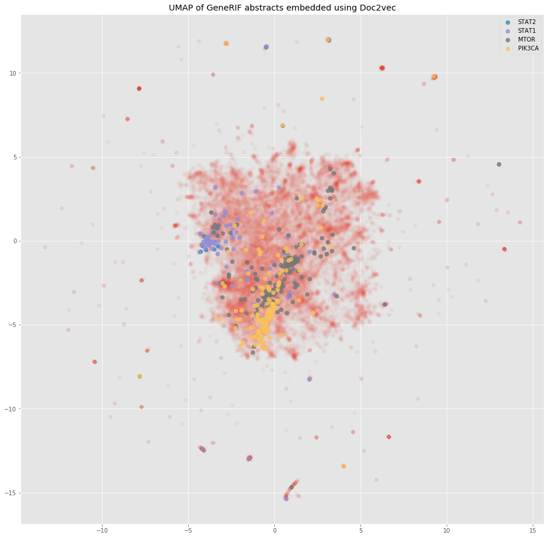
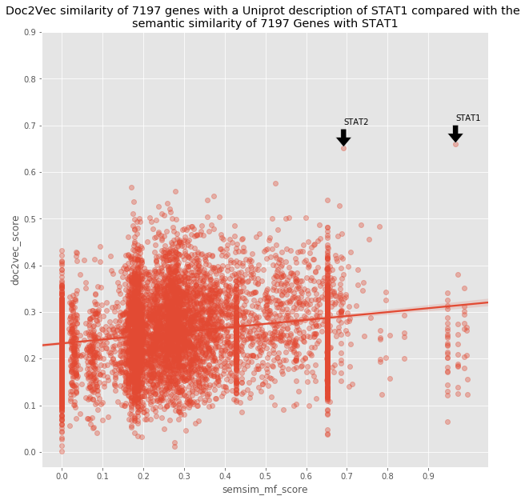

# generif2vec
Resources and tools to work with [Doc2vec](https://radimrehurek.com/gensim/models/doc2vec.html) and NCBI's [gene reference into
 function (GeneRIF)](https://www.ncbi.nlm.nih.gov/gene/about-generif).



## GeneRIF Abstracts
GeneRIF is a resource that includes gene annotations curated by genetics experts. The file used for training the 
Doc2vec model and for linking PubMed ID to Gene ID is 
[hosted by NCBI](ftp://ftp.ncbi.nih.gov/gene/GeneRIF/generifs_basic.gz).  

The [generif2vec/text](generif2vec/text) module has code to:
* Download the abstracts for GeneRIF PubMed articles.
* Process the abstracts from raw text into `TaggedDocuments` for Doc2vec using [spacy](https://spacy.io/).

*NOTE: The annotated gene symbol in each abstract was replaced with @gene$*

## Pretrained Doc2vec model
Download the pretrained 100-dimension Doc2vec model [here](https://generif2vec.s3.amazonaws.com/generif2vec.doc2vec)
 and use it as shown below.   

The parameter settings for this model were chosen after hyperparameter tuning was performed on Google Cloud AI Platform 
following the methods described in [trainer/README](trainer/README.md).

This model achieved `59.1%` top 5 accuracy and `64.1%` top 10 accuracy on a held out test set (25%) of abstracts.
More information regarding the evaluation of the model can be found in [evaluation](#evaluation).

### Installation
Installing the package makes it easy to work with your own text.
```shell script
git clone https:@github.com:arvkevi/generif2vec.git
cd generif2vec
python setup.py install
```

### Library Usage
Load the downloaded model as a Doc2vec model:
```python
from gensim.models.doc2vec import Doc2Vec
generif2vec_model = '/path/to/downloaded_model'
model = Doc2Vec.load(generif2vec_model)
```
Process sample text:  
From unseen text summary description of *STAT1* from Uniprot:
```python
stat1_uniprot = """
Signal transducer and transcription activator that mediates cellular responses to 
interferons, cytokine KITLG/SCF and other cytokines and other growth factors. Following type I IFN 
(IFN-alpha and IFN-beta) binding to cell surface receptors, signaling via protein kinases leads to activation of 
Jak kinases and to tyrosine phosphorylation of STAT1 and STAT2. The phosphorylated @genes dimerize and associate 
with ISGF3G/IRF-9 to form a complex termed ISGF3 transcription factor, that enters the nucleus.
"""
```
Process the text:
```python
from generif2vec.text.util import tokenize
test_tokens = tokenize([stat1_uniprot])
```
Explore the most similar results:
```python
test_vec = model.infer_vector(test_tokens[0])
model.docvecs.most_similar([test_vec], topn=10)

[('STAT2', 0.6756633520126343),
 ('STAT1', 0.6652628183364868),
 ('IRF9', 0.59737229347229),
 ('JAK1', 0.5927700996398926),
 ('IKBKB', 0.5757358074188232),
 ('TYK2', 0.567344069480896),
 ('IKBKE', 0.565180778503418),
 ('IFNB1', 0.5631940364837646),
 ('STAT3', 0.5513948798179626),
 ('IFNAR2', 0.5507417917251587)]
```

### Command Line Usage
There are currently two commands: `train-models` and `similar-genes`.

Train the Doc2vec models with different parameters.
```bash
generif2vec train-models -- --help
```
Predict the most similar gene for a directory of text files.
```bash
generif2vec similar-genes -- --help
```

## Abstracts stats
Number of unique genes with at least 10 PubMed IDs: `7704`  
Number of abstracts with genes having at least 10 PubMed IDs: `731,297`

## Evaluation
The `trainer` module will evaluate document embeddings by default.
Evaluation of the document embeddings was performed by splitting the abstracts into training and test data stratified 
by gene symbol for equal proportions of gene symbols in each set. The model was trained on the training data set and
evaluated on the test data set.

| Top 5 Accuracy | Top 10 Accuracy | Median Gene Rank | Median Similarity Difference |
| -------------- | --------------- | ---------------- | ---------------------------- |
| 59.1% | 64.9% | 4  | 0.049 |

* `top_k accuracy`: The percentage of abstracts in the test set where the true gene label was in the top `k` most similar 
predicted gene labels. (Top `5` of `7704` = `0.06% of all gene labels`)  
* `median gene rank`: The median ranking of the true gene label among all `7704` gene labels in the test set.  
* `median similarity difference`: The median difference between the top ranked document similarity value (using Doc2vec 
[most_similar](https://radimrehurek.com/gensim/models/keyedvectors.html#gensim.models.keyedvectors.Doc2VecKeyedVectors.most_similar))
 and the document similarity for the true gene label.

### Comparison to Gene Ontolgoy
Use [this notebook](notebooks/go_semantic_similarity.ipynb) to compare the results of `Doc2vec` embeddings to gene similarity using 
the molecular function branch of the Gene Ontology with [GoSemSim](https://bioconductor.org/packages/devel/bioc/vignettes/GOSemSim/inst/doc/GOSemSim.html).




I want to share some initial results from a #genomics #machinelearning project that I'm hacking on in my free time. 


It uses Doc2vec to generate document embeddings from Gene Reference into Function (GeneRIF) annotations provided by the National Center for Biotechnology Information (NCBI). 

I downloaded and embedded over 731,000 PubMed abstracts spanning 7,704 unique genes. 


The model achieves 

Check out the code here and please share your thoughts on how to improve and/or evaluate the model.


https://github.com/arvkevi/generif2vec